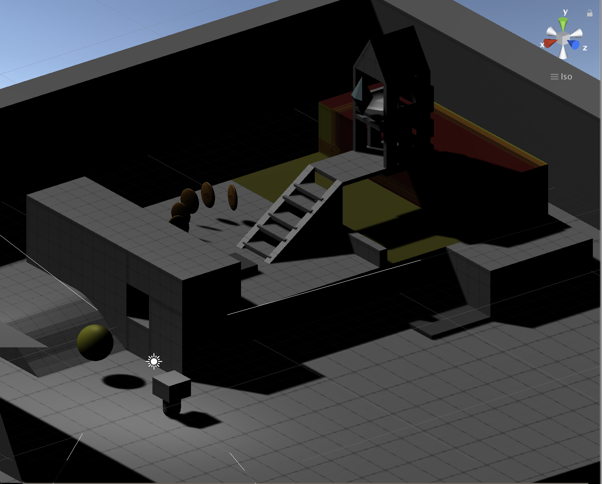
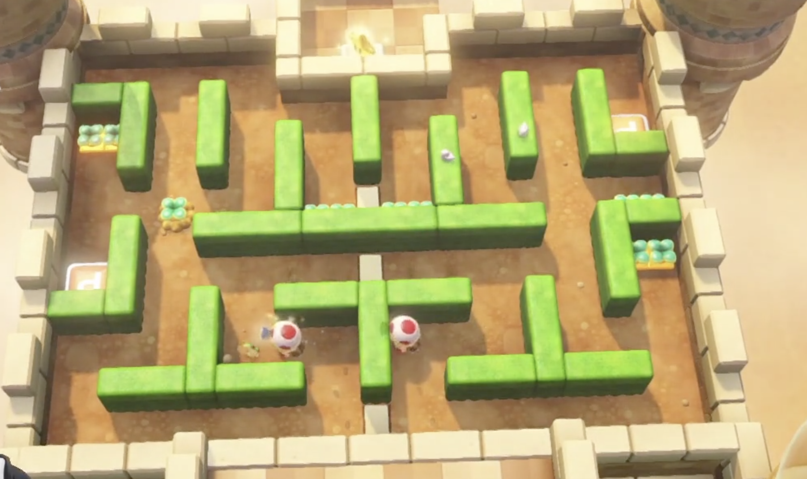

# Captain-Toad

## 原关卡改进

1. 1. 正确处理角色掉入悬崖的情况，比如死亡重生，或根本无法掉落；
   2. 加入金币与钻石；
   3. 禁止在空中能调整水平移动，使移动手感尽量接近蘑菇队长；
   4. 加入通关动画；

2. 

## 双樱桃关卡

### 游戏说明

参考了蘑菇队长双樱桃关卡的设计。玩家同时操控两个蘑菇队长，键位绑定一致。融入了之前场景用到的触发器和桥梁、高塔，使其合作达到塔顶，并吃掉所有的钻石和金币。

### 关卡原型：

### 场景搭建：

